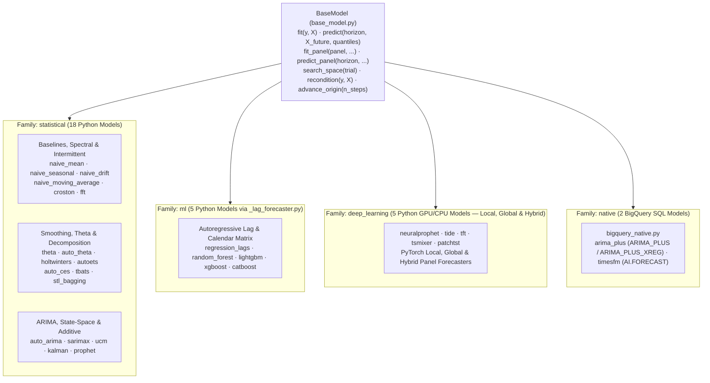

# Forecasting Models (`src/scale_forecasting/models/`)

This subpackage contains all **30 built-in forecasting models** (28 Python models and 2 BigQuery-native SQL models), the [`BaseModel`](./base_model.py) interface they implement, the shared autoregressive lag/covariate engine ([`_lag_forecaster.py`](./_lag_forecaster.py)), the shared Nixtla `neuralforecast` adapter ([`_neuralforecast_base.py`](./_neuralforecast_base.py)), and the model catalogue registry ([`__init__.py`](./__init__.py)).

Every model lives in its own file and registers itself on import via `register(ModelClass)`. Models are grouped into four **families** (`statistical`, `ml`, `deep_learning`, and `native`), which [`dag.py`](../dag.py) uses to route each family to its optimal compute runtime in parallel.

---

## Model Catalogue

| Model Name | File | Family | Runtime | Upstream Package | Accepts `exog` | Training Modes | GPU Support | Description |
| :--- | :--- | :--- | :--- | :--- | :---: | :---: | :---: | :--- |
| `naive_mean` | [`naive_mean.py`](./naive_mean.py) | `statistical` | Python | [`numpy`](https://numpy.org/) | No | `local` | CPU only | Constant forecast equal to the training sample mean with empirical residual intervals. |
| `naive_seasonal` | [`naive_seasonal.py`](./naive_seasonal.py) | `statistical` | Python | [`numpy`](https://numpy.org/) | No | `local` | CPU only | Repeats the final observed seasonal cycle (`m` inferred from series frequency). |
| `naive_drift` | [`naive_drift.py`](./naive_drift.py) | `statistical` | Python | [`numpy`](https://numpy.org/) | No | `local` | CPU only | Linear trend connecting the first and last training observations. |
| `naive_moving_average` | [`naive_moving_average.py`](./naive_moving_average.py) | `statistical` | Python | [`numpy`](https://numpy.org/) | No | `local` | CPU only | Trailing `window`-step simple moving average. |
| `croston` | [`croston.py`](./croston.py) | `statistical` | Python | [`numpy`](https://numpy.org/) | No | `local` | CPU only | Intermittent-demand decomposition (`classic`, `sba`, or `tsb` variant) for zero-heavy series. |
| `fft` | [`fft.py`](./fft.py) | `statistical` | Python | [`scipy`](https://scipy.org/) | No | `local` | CPU only | Discrete Fourier Transform spectral extrapolation with polynomial detrending (`scipy.fft.rfft`). |
| `theta` | [`theta.py`](./theta.py) | `statistical` | Python | [`statsmodels`](https://www.statsmodels.org/) | No | `local` | CPU only | Assimakopoulos-Nikolopoulos Theta method (`statsmodels.tsa.forecasting.theta.ThetaModel`). |
| `auto_theta` | [`auto_theta.py`](./auto_theta.py) | `statistical` | Python | [`statsforecast`](https://nixtlaverse.nixtla.io/statsforecast/) | No | `local` | CPU only | Automated Theta variant selection (`STM`, `OTM`, `DSTM`, `DOTM`) via `statsforecast.models.AutoTheta`. |
| `holtwinters` | [`holtwinters.py`](./holtwinters.py) | `statistical` | Python | [`statsmodels`](https://www.statsmodels.org/) | No | `local` | CPU only | Additive Holt-Winters exponential smoothing with automatic fallback on short series. |
| `autoets` | [`autoets.py`](./autoets.py) | `statistical` | Python | [`statsmodels`](https://www.statsmodels.org/) | No | `local` | CPU only | State-space Exponential Smoothing (`ETSModel`) with analytical prediction intervals. |
| `auto_ces` | [`auto_ces.py`](./auto_ces.py) | `statistical` | Python | [`statsforecast`](https://nixtlaverse.nixtla.io/statsforecast/) | No | `local` | CPU only | Automated Complex Exponential Smoothing (`statsforecast.models.AutoCES`). |
| `tbats` | [`tbats_model.py`](./tbats_model.py) | `statistical` | Python | [`statsforecast`](https://nixtlaverse.nixtla.io/statsforecast/) | No | `local` | CPU only | Trigonometric seasonality, Box-Cox transform, ARMA errors, Trend, and Seasonal components (`AutoTBATS`). |
| `stl_bagging` | [`stl_bagging.py`](./stl_bagging.py) | `statistical` | Python | [`statsmodels`](https://www.statsmodels.org/) | No | `local` | CPU only | Bergmeir-Hyndman-Benítez STL decomposition with moving-block-bootstrapped ETS ensembles. |
| `auto_arima` | [`auto_arima.py`](./auto_arima.py) | `statistical` | Python | [`statsforecast`](https://nixtlaverse.nixtla.io/statsforecast/) | Yes | `local` | CPU only | Hyndman-Khandakar automatic stepwise AICc seasonal ARIMA (`statsforecast.models.AutoARIMA`). |
| `sarimax` | [`sarimax.py`](./sarimax.py) | `statistical` | Python | [`statsmodels`](https://www.statsmodels.org/) | Yes | `local` | CPU only | Seasonal ARIMA (`SARIMAX`) with exogenous regressor support and state-space intervals. |
| `ucm` | [`ucm.py`](./ucm.py) | `statistical` | Python | [`statsmodels`](https://www.statsmodels.org/) | Yes | `local` | CPU only | Unobserved Components structural state-space model (local linear trend + trigonometric seasonality). |
| `kalman` | [`kalman.py`](./kalman.py) | `statistical` | Python | [`statsmodels`](https://www.statsmodels.org/) | Yes | `local` | CPU only | State-space Kalman filter (`UnobservedComponents`) with trigonometric seasonal harmonics and optional AR($p$) state. |
| `prophet` | [`prophet_model.py`](./prophet_model.py) | `statistical` | Python | [`prophet`](https://facebook.github.io/prophet/) | Yes | `local` | CPU only | Prophet piecewise trend + Fourier seasonality + country holidays and exogenous covariates. |
| `regression_lags` | [`regression_lags.py`](./regression_lags.py) | `ml` | Python | [`scikit-learn`](https://scikit-learn.org/) | Yes | `local` | CPU only | L2-regularized (`Ridge`) linear model over recursive target lags (`1, 2, 3, 7, 14, 28`), calendar features, and `exog`. |
| `random_forest` | [`random_forest.py`](./random_forest.py) | `ml` | Python | [`scikit-learn`](https://scikit-learn.org/) | Yes | `local` | CPU only | Bagged decision tree ensemble (`RandomForestRegressor`) over recursive target lags, calendar features, and `exog`. |
| `lightgbm` | [`lightgbm_model.py`](./lightgbm_model.py) | `ml` | Python | [`lightgbm`](https://lightgbm.readthedocs.io/) | Yes | `local` | CPU only | `LGBMRegressor` fitted on recursive target lags, calendar features, and `exog` (`n_jobs=1` per worker). |
| `xgboost` | [`xgboost_model.py`](./xgboost_model.py) | `ml` | Python | [`xgboost`](https://xgboost.readthedocs.io/) | Yes | `local` | Optional (`cuda`) | `XGBRegressor` (`tree_method="hist"`) over recursive target lags, calendar features, and `exog`. |
| `catboost` | [`catboost_model.py`](./catboost_model.py) | `ml` | Python | [`catboost`](https://catboost.ai/) | Yes | `local` | CPU only | Oblivious gradient-boosted trees (`CatBoostRegressor`) over recursive target lags, calendar features, and `exog`. |
| `neuralprophet` | [`neuralprophet_model.py`](./neuralprophet_model.py) | `deep_learning` | Python | [`neuralprophet`](https://neuralprophet.com/) | No | `local`, `global`, `hybrid` | Beneficial (`cuda`) | PyTorch AR-Net + trend/seasonality + quantile regression; supports local, global, and hybrid local-global modes. |
| `tide` | [`tide.py`](./tide.py) | `deep_learning` | Python | [`neuralforecast`](https://nixtlaverse.nixtla.io/neuralforecast/) | Yes | `local`, `global` | Beneficial (`cuda`) | Time-series Dense Encoder (`TiDE`, Das et al. 2023) with future, past, and static covariates + `MQLoss` quantiles. |
| `tft` | [`tft.py`](./tft.py) | `deep_learning` | Python | [`neuralforecast`](https://nixtlaverse.nixtla.io/neuralforecast/) | Yes | `local`, `global` | Beneficial (`cuda`) | Temporal Fusion Transformer (`TFT`, Lim et al. 2021) with variable selection networks and multi-head attention. |
| `tsmixer` | [`tsmixer.py`](./tsmixer.py) | `deep_learning` | Python | [`neuralforecast`](https://nixtlaverse.nixtla.io/neuralforecast/) | Yes | `local`, `global` | Beneficial (`cuda`) | All-MLP time- and feature-mixing architecture (`TSMixerx`, Chen et al. 2023) with future, past, and static covariates. |
| `patchtst` | [`patchtst.py`](./patchtst.py) | `deep_learning` | Python | [`neuralforecast`](https://nixtlaverse.nixtla.io/neuralforecast/) | No | `local`, `global` | Beneficial (`cuda`) | Channel-independent subseries-patch Transformer (`PatchTST`, Nie et al. 2023) with `MQLoss` quantile heads. |
| `arima_plus` | [`bigquery_native.py`](./bigquery_native.py) | `native` | BigQuery | [`bigquery-ml`](https://cloud.google.com/bigquery/docs/bqml-introduction) | No | `local` | Managed SQL | BigQuery ML `ARIMA_PLUS` (with custom country holiday CTEs and `ARIMA_PLUS_XREG` SQL builder support). |
| `timesfm` | [`bigquery_native.py`](./bigquery_native.py) | `native` | BigQuery | [`bigquery-ml`](https://cloud.google.com/bigquery/docs/bqml-introduction) | No | `local` (zero-shot) | Managed SQL | Zero-shot foundation-model forecasting via BigQuery `AI.FORECAST` (`TimesFM 2.0`, `TimesFM 2.5` default, or `TimesFM 3.0`). |

---

## Core Abstractions

### [`BaseModel`](./base_model.py)
Every model subclasses `BaseModel` and declares:
- **`name`**, **`runtime`** (`"python"` or `"bigquery"`), and **`family`** (`"statistical"`, `"ml"`, `"deep_learning"`, or `"native"`).
- **`package`**, **`package_url`**, **`optional_import`**, and **`optional_extra`** for upstream package provenance and graceful optional-dependency probing (`cls.is_available()`).
- **`supports_exog`**, **`supports_future_covariates`**, **`supports_past_covariates`**, and **`supports_static_covariates`** declaring which tiers of covariates (`future_covariates`, `past_covariates`, `static_covariates`) the model consumes.
- **`supports_global`** and **`supports_hybrid`** (`bool`), plus **`fit_panel(panel, ...)`** and **`predict_panel(horizon, ...)`** for cross-series global and hybrid panel training (`training_mode: "local" | "global" | "hybrid"`).
- **`gpu_capable`** (`bool`) and **`gpu_useful(params)`** (`bool`), which drive plan-time hardware preflight checks ([`hardware.py`](../hardware.py)).
- **`lags_covariates_internally`** (`bool`, default `False`), which tells [`features.py`](../features.py) whether to pass unlagged covariates only so a model never double-lags `features.exog_lags`.
- **`fit(y, X=None) -> Self`** and **`predict(horizon, X_future=None, quantiles=(0.1, 0.9)) -> DataFrame`** returning `ds`, `yhat`, `yhat_lower`, `yhat_upper`, and `quantiles`.
- **`search_space(trial)`** for Optuna hyperparameter tuning ([`hpo.py`](../hpo.py)) and **`recondition(y, X)`** / **`advance_origin(n_steps)`** for `expanding_frozen` and `expanding_stale` backtesting ([`backtest.py`](../backtest.py)).

### [`_lag_forecaster.py`](./_lag_forecaster.py)
Shared engine behind `regression_lags`, `random_forest`, `lightgbm`, `xgboost`, and `catboost`. It constructs a tabular feature matrix combining target lags (`1, 2, 3, 7, 14, 28`), calendar features (`dow`, `dom`, `month`, `doy`), and exogenous covariates (`X`), performs recursive multi-step prediction where each step's `yhat` feeds subsequent target lags, and computes empirical residual prediction intervals.

### [`_neuralforecast_base.py`](./_neuralforecast_base.py)
Shared adapter behind `tide`, `tft`, `tsmixer`, and `patchtst`. Wraps Nixtla's `neuralforecast` PyTorch Lightning architectures with `MQLoss(quantiles=[0.1, 0.5, 0.9])`, supports both per-series (`training_mode="local"`) and cross-series panel (`training_mode="global"`) execution, and routes `future_covariates` (`futr_exog_list`), `past_covariates` (`hist_exog_list`), and `static_covariates` (`stat_exog_list`).

---

## Reference & Extending

- **Complete model & hyperparameter reference:** [`docs/models_reference.md`](../../../docs/models_reference.md)
- **Adding a new model in one file:** [`docs/adding_a_model.md`](../../../docs/adding_a_model.md) + [`docs/model_template.py`](../../../docs/model_template.py)
