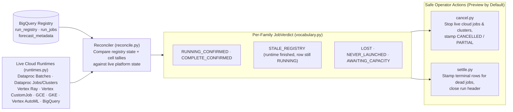

# Runtime Probes & Reconciliation (`src/scale_forecasting/probes/`)

Because `run_jobs` and `run_registry` rows are written by the launching driver and workers, an abrupt driver crash, VM termination, or network partition can leave a job row reading `RUNNING` or `EMITTED` after the underlying cloud job has already finished or vanished.

The `probes` subpackage bridges **what the BigQuery registry recorded** and **what the live Google Cloud runtimes (Dataproc Serverless, Dataproc GCE Clusters, Ray on Vertex AI, Vertex AI `CustomJob`, Compute Engine Single-VM, Google Kubernetes Engine, Vertex AI AutoML Tabular Workflows, and BigQuery Jobs) report right now**.



---

## Modules in This Subpackage

| File | Role |
| :--- | :--- |
| [`vocabulary.py`](./vocabulary.py) | Defines the pure data structures and enums shared across all probe operations: `RuntimeState` (`ACTIVE`, `SUCCEEDED`, `FAILED`, `CANCELLED`, `NOT_FOUND`, `UNKNOWN`), `JobVerdict` (`COMPLETE_CONFIRMED`, `RUNNING_CONFIRMED`, `STALE_REGISTRY`, `LOST`, `NEVER_LAUNCHED`, `AWAITING_CAPACITY`, `FAILED_CONFIRMED`, `CANCELLED_CONFIRMED`, `NOT_SUBMITTED`), `ProbeEntry`, `ProbeReport`, `CancelPlan`, and `SettlePlan`. |
| [`runtimes.py`](./runtimes.py) | Thin, fault-tolerant platform status readers (`DataprocBatchProbe`, `DataprocClusterProbe`, `RayProbe`, `VertexProbe`, `GceProbe`, `GkeProbe`, `VertexAutoMLProbe`, `BigQueryProbe`) that translate native GCP API responses into normalized `ProbeObservation` objects without raising on missing resources. |
| [`reconcile.py`](./reconcile.py) | Pure reconciliation engine (`reconcile_job`, `reconcile_run`) plus the live entry point (`probe_run`). Combines each family's `run_jobs` row, cell completion count (`n_done / n_expected`), quiet duration (`quiet_seconds`), startup grace window (`900s`), and live `ProbeObservation` into an actionable `ProbeReport`. |
| [`cancel.py`](./cancel.py) | Implements preview-by-default run cancellation (`cancel_run`, `CLI --cancel`, `Forecaster.cancel()`). Identifies live platform jobs, ephemeral clusters, GCE VMs, and GKE Jobs, cancels/deletes them when `execute=True`, preserves any completed cell buckets as `PARTIAL`, and stamps terminal `run_jobs` and `run_registry` rows. |
| [`settle.py`](./settle.py) | Implements preview-by-default run settling (`settle_run`, `CLI --settle`, `Forecaster.settle()`). Safely closes runs whose jobs are already dead on the platform (`LOST`, `STALE_REGISTRY`, `NEVER_LAUNCHED`, or abandoned `AWAITING_CAPACITY`) without touching any job that is still `RUNNING_CONFIRMED`. |

---

## Usage Examples

```python
from scale_forecasting import Forecaster

fc = Forecaster.from_run_id("my-run-a1b2c3d4e5f6")

# 1. Read-only reconciliation against Dataproc / Vertex / BigQuery
report = fc.probe()
print(report)

# 2. Settle stale or lost jobs (preview first, then execute)
print(fc.settle(execute=False))
fc.settle(execute=True)

# 3. Cancel an in-flight run while retaining completed cells
print(fc.cancel(execute=False))
fc.cancel(execute=True)
```
