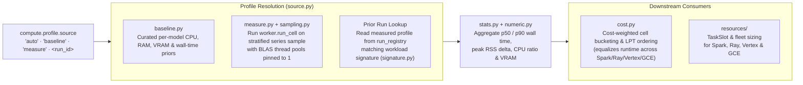

# Workload Profiling & Cost Estimation (`src/scale_forecasting/profiling/`)

Different forecasting models have vastly different resource footprints: a `naive_mean` or `theta` fit takes milliseconds and minimal RAM, whereas `stl_bagging`, `sarimax`, or `neuralprophet` with backtesting and HPO can take seconds per series and hundreds of megabytes of memory.

The `profiling` subpackage determines each model's per-cell resource profile (`WorkloadProfile`) — either from a curated offline **baseline table** (`baseline.py`), by **measuring a small stratified sample** of series before the main fan-out (`measure.py`), or from a prior run in the registry (`source.py`) — and uses those costs to pack balanced work buckets (`cost.py`) and size compute fleets ([`resources/`](../resources/README.md)).

---

## Modules in This Subpackage

| File | Role |
| :--- | :--- |
| [`baseline.py`](./baseline.py) | Built-in empirical priors (`BASELINE_PROFILES`) for all registered Python models, scaled dynamically by backtest fold count (`n_folds`) and HPO trial count (`n_trials`). Used immediately when `compute.profile.source: "baseline"` or when measurement is skipped. |
| [`sampling.py`](./sampling.py) | Selects a deterministic, length-stratified sample of series (`select_sample_series`) from the panel so pre-pass profiling and fleet-wide HPO evaluate short, medium, and long series rather than biasing toward whichever series arrive first. |
| [`measure.py`](./measure.py) | Runs [`worker.run_cell`](../worker.py) over the sampled series inside a controlled single-thread context (`threadpoolctl.threadpool_limits(limits=1)` and `OMP_NUM_THREADS=1`), capturing wall clock, CPU user+system time, peak RSS memory delta, and CUDA memory allocation per cell. |
| [`stats.py`](./stats.py) | Aggregates raw per-cell measurement observations into a `ModelProfile` and `WorkloadProfile` (`p50`/`p90` wall seconds, CPU-to-wall ratio, memory bytes, and GPU VRAM bytes). |
| [`signature.py`](./signature.py) | Computes a deterministic `workload_signature` hash covering the config fields that affect per-cell compute cost (`models`, `horizon`, `backtest`, `features`, `hpo`) so profiles from compatible prior runs can be reused safely. |
| [`source.py`](./source.py) | Orchestrates profile resolution (`resolve_workload_profile`): selects between `baseline`, live `measure`, or registry lookup according to `compute.profile.mode` and `compute.profile.source`. |
| [`cost.py`](./cost.py) | Computes relative per-model cell weights from a `WorkloadProfile` so [`spark_explode.py`](../engines/spark_explode.py) and [`ray_io.py`](../engines/ray_io.py) pack fewer heavy models (`sarimax`, `neuralprophet`) and more fast models (`theta`, `naive_*`) per task chunk, eliminating straggler tasks. |
| [`numeric.py`](./numeric.py) | Safe finite-float coercion helpers (`clean_float`, `positive_or_none`) for serializing profiling telemetry to BigQuery JSON. |
