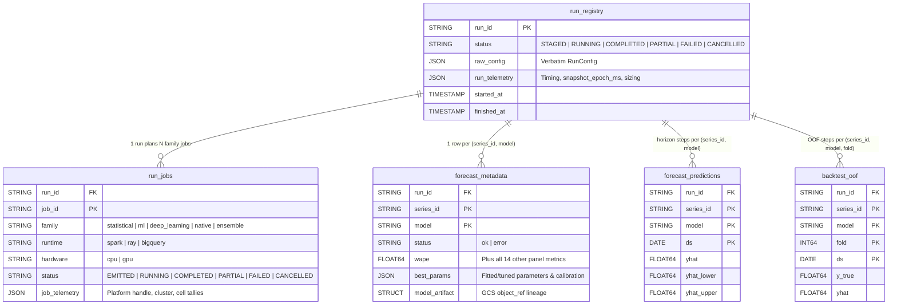

# BigQuery Run Registry (`src/scale_forecasting/registry/`)

This subpackage owns the **data and metadata layer** of `scale-forecasting`: the five native BigQuery registry tables, the two source panel tables (`source_series_iceberg` and `source_series_native`), the four analyst SQL views, the high-throughput Storage Write API writer, the deterministic `run_id` hash calculator, and the eight-verb operator maintenance surface (`Registry` / `python -m scale_forecasting.registry.ops`).

---

## Modules in This Subpackage

### 1. Schema, Views & Identity
- **[`ddl.py`](./ddl.py):** Pure SQL DDL generator for the two source tables (`source_series_iceberg`, `source_series_native`) and five registry tables (`run_registry`, `run_jobs`, `forecast_metadata`, `forecast_predictions`, `backtest_oof`), plus idempotent `ALTER TABLE ... ADD COLUMN IF NOT EXISTS` migrations derived from `METRIC_NAMES`.
- **[`views.py`](./views.py):** Pure SQL definitions for the four analyst views created over the registry:
  - `v_run_summary`: One row per run joining `run_registry` with cell completion counts and best model accuracy.
  - `v_run_jobs`: Deduplicated per-family job execution trace with runtime, hardware, and platform job IDs.
  - `v_model_leaderboard`: Per-run model ranking across all 15 metrics with `RANK() OVER (PARTITION BY run_id ORDER BY wape)`.
  - `v_forecast_results`: Latest deduplicated horizon forecasts joined with each cell's backtest metrics and fitted parameters.
- **[`tables.py`](./tables.py):** Idempotent `ensure_tables(settings)` helper that creates missing tables, applies additive column migrations, and refreshes the four analyst views.
- **[`ids.py`](./ids.py):** Computes deterministic `<slug>-<12hex>` `run_id`s (`make_run_id`) from canonicalized `RunConfig` JSON, maintaining historical `run_id` stability via `_REMOVED_DEFAULTS` and `_DEFAULT_ELIDED`.

### 2. High-Throughput Writing & Lifecycle
- **[`write_api.py`](./write_api.py):** Streams rows to BigQuery using the **BigQuery Storage Write API** (`append_rows` over dynamically generated Protobuf descriptors), supporting native `JSON` columns (`raw_config`, `run_telemetry`, `job_telemetry`, `best_params`, `quantiles`) without load-job quota limits.
- **[`rows.py`](./rows.py) & [`params.py`](./params.py):** Pure row assemblers (`assemble_metadata_row`, `assemble_prediction_rows`, `assemble_oof_rows`, `assemble_run_row`, `assemble_job_row`) and JSON-safe parameter serializers.
- **[`cells.py`](./cells.py) & [`harvest.py`](./harvest.py):** Coordinates streaming batches of `CellResult` objects into `forecast_metadata`, `forecast_predictions`, and `backtest_oof`, and tallies cell completion outcomes (`JobHarvest`).
- **[`header.py`](./header.py), [`jobs.py`](./jobs.py) & [`lifecycle.py`](./lifecycle.py):** Context managers (`run_header`, `job_trace`) and append-only status transitions for `run_registry` and `run_jobs`.
- **[`artifacts.py`](./artifacts.py):** Uploads pickled fitted models and ensemble artifacts to GCS (`gs://<warehouse>/artifacts/<project>/<registry_dataset>/<run_id>/...`) and builds BigQuery `ObjectRef` structs.

### 3. Queries & Operator Maintenance
- **[`reads.py`](./reads.py):** Read queries backing the SDK, ensembler, and run reviewer (`run_exists`, `read_run_config`, `read_progress`, `read_metric_aggregates`, `read_cell_metrics`, `fetch_oof_and_forecasts`, `fetch_completed_cells`).
- **[`ops.py`](./ops.py):** Implements the 8 operator maintenance verbs (exposed via `python -m scale_forecasting.registry.ops <verb>` and the `Registry` SDK class in [`sdk.py`](../sdk.py)):
  - `init`: Ensure all registry tables and analyst views exist.
  - `doctor`: Read-only health check reporting table row counts, runs stuck at `RUNNING`, and orphaned GCS/BQML artifacts.
  - `close-runs`: Roll terminal `run_jobs` rows up against the run's planned DAG to close abandoned `RUNNING`/`STAGED` headers (`preview=True` by default).
  - `drop-run`: Delete a run's GCS artifacts, BQML `sf_model_*` objects, and rows across all five registry tables (`preview=True` by default).
  - `sweep-orphans`: Reclaim GCS artifact prefixes and BQML models whose `run_id` has no header in `run_registry`.
  - `reap-clusters`: Delete leaked Vertex AI Ray clusters whose owning `run_id` is already terminal in `run_registry`.
  - `snapshot`: Copy a run's rows across all five registry tables into a backup dataset.
  - `export`: Export a run's forecasts and metadata to Parquet on GCS.

---

## Reference Links

- **Column-by-column schema & view reference:** [`docs/output_schemas.md`](../../../docs/output_schemas.md)
- **Why append-only Storage Write API + dedupe-on-read:** [`docs/writing_results.md`](../../../docs/writing_results.md)
- **Operator runbook (`Registry` & CLI):** [`docs/operations.md`](../../../docs/operations.md)
