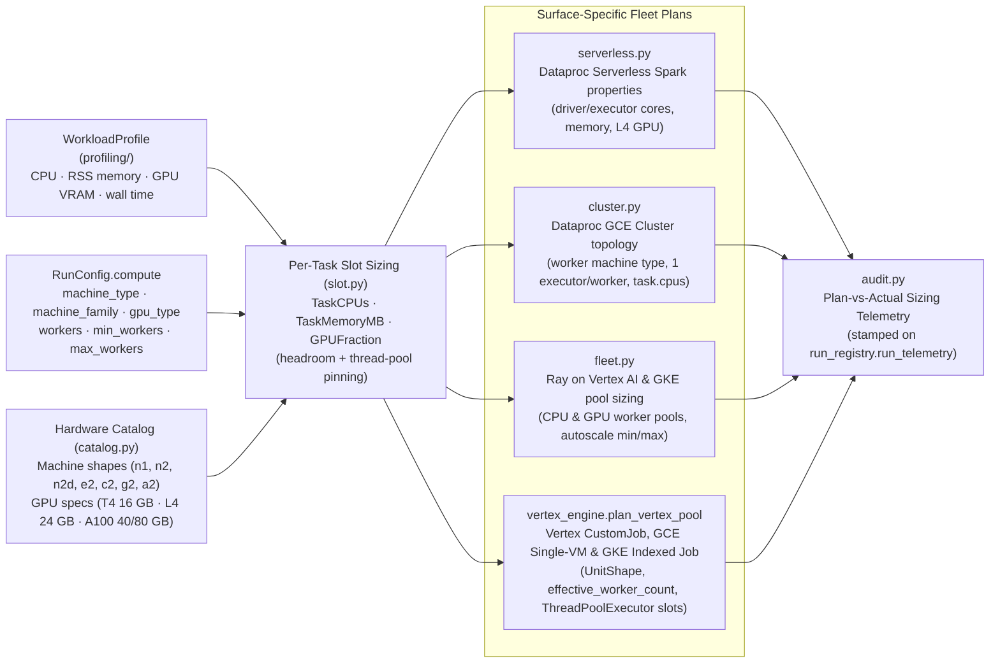

# Resource Sizing & Hardware Translation (`src/scale_forecasting/resources/`)

This subpackage translates **what a model family needs per cell** (from [`profiling/`](../profiling/README.md)) and **what the cloud region allows** (from [`quota.py`](../quota.py) and [`RunConfig.compute`](../config.py)) into concrete executor, worker, and task resource requests across all five Python compute surfaces:
1. **Dataproc Serverless** (`serverless.py`)
2. **Dataproc GCE Clusters** (`cluster.py`)
3. **Ray on Vertex AI & GKE** (`fleet.py` + `slot.py`)
4. **Vertex AI `CustomJob`, Compute Engine Single-VM & GKE Indexed Jobs** (`catalog.py` + `slot.py` + [`engines/vertex_engine.py`](../engines/vertex_engine.py))

Every function in `resources/` is **pure** (zero network or cloud I/O), making the entire sizing pipeline deterministic and unit-tested offline in [`tests/unit/test_resources.py`](../../../tests/unit/test_resources.py).

---

## Modules in This Subpackage

| File | Role |
| :--- | :--- |
| [`catalog.py`](./catalog.py) | Single source of truth for GCE machine shapes (`n1`, `n2`, `n2d`, `e2`, `c2`, `g2`, `a2`), CPU-to-memory ratios, and NVIDIA accelerator specifications (`NVIDIA_TESLA_T4` 16 GB, `NVIDIA_L4` 24 GB, `NVIDIA_TESLA_A100` 40 GB, `NVIDIA_A100_80GB` 80 GB). |
| [`slot.py`](./slot.py) | Computes the per-cell task slot (`TaskSlot`: `num_cpus`, `memory_bytes`, `gpu_fraction`) from a measured or baseline `WorkloadProfile`, reserving node OS/raylet overhead (1 core and memory headroom) and generating `OMP_NUM_THREADS` / `MKL_NUM_THREADS` / `OPENBLAS_NUM_THREADS` / `NUMEXPR_NUM_THREADS` pins so multi-threaded C/Fortran libraries do not oversubscribe workers. |
| [`serverless.py`](./serverless.py) | Translates a `WorkloadProfile` and `RunConfig` into Dataproc Serverless Spark properties (`spark.driver.cores`, `spark.driver.memory`, `spark.executor.cores`, `spark.executor.memory`, `spark.dynamicAllocation.maxExecutors`, and L4 GPU resource configs). |
| [`cluster.py`](./cluster.py) | Sizes ephemeral Dataproc GCE clusters (`ClusterSizingPlan`): selects the master and worker machine types from `compute.machine_family` (or `g2-standard-*` / `n1-standard-*` / `a2-*` on GPU), configures one fat executor per worker VM, sets `spark.task.cpus` and `spark.task.resource.gpu.amount`, and derives the worker count from total cell work and regional quota. |
| [`fleet.py`](./fleet.py) | Sizes Ray on Vertex AI worker pools (`RayFleetPlan`): computes CPU and GPU node counts (`min_replica_count`, `max_replica_count`) using a three-way minimum of workload demand, user-configured ceiling (`max_workers` / `ray_cpu_max_nodes` / `ray_gpu_max_nodes`), and available regional quota. |
| [`audit.py`](./audit.py) | Builds the structured sizing telemetry payload (`sizing_audit_entry`) recorded on `run_registry.run_telemetry` so every run preserves the exact profile, slot math, and fleet plan that governed it. |

---

## Reference Links

- **Throughput benchmarks, node density math & regional quota guide:** [`docs/quota_and_scale.md`](../../../docs/quota_and_scale.md)
- **Workload profiling & measurement subpackage:** [`src/scale_forecasting/profiling/README.md`](../profiling/README.md)
