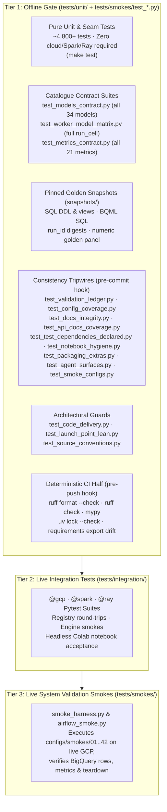

# Test Suite (`tests/`)

`scale-forecasting` uses a three-tier test architecture designed so that **every core invariant, model contract, SQL query, sizing formula, and documentation claim is verified offline in minutes** (`make test`), while live cloud integration and end-to-end multi-runtime smoke runs have dedicated, reproducible harnesses.



---

## Running the Tests

### 1. Fast Consistency Tripwires (pre-commit hook, seconds)

Two tracked hooks in [`.githooks/`](../.githooks/) run automatically once enabled via `make hooks` (one-time per clone):

- **`pre-commit`** runs the AGENTS.md Gate 1 tripwires — the validation ledger, config coverage, docs integrity, API-docs coverage, test-dependency declaration, notebook hygiene, packaging extras, agent-surface sync, and smoke-config validity. They compare prose, declarations, and persisted notebook outputs against code and policy, so an edit made after a green `make test` can turn them red with no code change.
- **`pre-push`** runs the deterministic half of CI at the moment a commit leaves the machine — `ruff format --check`, `ruff check`, `mypy src/scale_forecasting` (zero errors; the package ships `py.typed`), `uv lock --check`, and a `docker/requirements.txt` export-drift check (same flags as `make lock`, read from the Makefile's `EXPORT_ARGS`).

```bash
make hooks  # one-time setup per clone
uv run pytest tests/unit/test_validation_ledger.py tests/unit/test_config_coverage.py tests/unit/test_docs_integrity.py tests/unit/test_api_docs_coverage.py tests/unit/test_test_dependencies_declared.py tests/unit/test_notebook_hygiene.py tests/unit/test_packaging_extras.py tests/unit/test_agent_surfaces.py tests/smokes/test_smoke_configs.py -q
```

To reproduce the CI `offline` job's environment exactly (a second `.venv-ci` synced with `uv sync --frozen --all-extras` and nothing else — no `docs` group, no ad-hoc installs), run `make ci-offline`. It catches the one failure shape your working venv cannot: a test that imports a package only your machine has.

### 2. Full Offline Gate (`make test`)

Runs `ruff format --check`, `ruff check` (pyflakes, pycodestyle, isort, bugbear, pyupgrade, plus `SIM`, `C4`, `PIE`, `PERF`, `RUF`, and `BLE` — every `except Exception` must carry `# noqa: BLE001` and a reason), `mypy` over `src/` (`make typecheck` on its own), and all offline unit, contract, and snapshot tests (deselecting `@gcp`, `@spark`, and `@ray` markers) **under the coverage floor** — the CI `offline` job, step for step. The pytest step runs with `--cov`; line coverage of `src/scale_forecasting` must stay at or above `fail_under` in `pyproject.toml`'s `[tool.coverage.report]` (85 %, set just under the 85.77 % measured when it was introduced). The floor is a ratchet: raise it when coverage rises, never lower it. The uncovered tail is the cloud-launch code the live smoke ledger proves instead.

```bash
make test
# Or directly with pytest (the exact command is the Makefile's OFFLINE_PYTEST):
uv run pytest -m "not gcp and not spark and not ray" -q --cov --cov-report=term-missing
```

### 3. Live Cloud Integration & Smoke Suites

Requires an active GCP deployment and `SF_*` environment variables exported:

```bash
# Run live BigQuery/GCP integration tests
uv run pytest -m gcp tests/integration/

# Run headless Colab Enterprise acceptance across all 11 notebooks
uv run pytest -m gcp tests/integration/test_notebook_acceptance.py

# Run a numbered end-to-end smoke config from configs/smokes/
uv run python -m tests.smokes.smoke_harness --only 01_serverless_cpu
```

---

## Directory Structure

| Directory / File | Purpose |
| :--- | :--- |
| [`conftest.py`](./conftest.py) | Shared pytest fixtures, marker registrations (`gcp`, `spark`, `ray`, `airflow`), and autouse guards that prevent offline unit tests from reading ambient `SF_*` environment variables or making accidental cloud calls. |
| **[`unit/`](./unit/)** | 70+ test modules covering every module in `src/scale_forecasting/`. Includes contract suites (`test_models_contract.py`, `test_metrics_contract.py`, `test_worker_model_matrix.py`), architectural guards (`test_code_delivery.py`, `test_launch_point_lean.py`, `test_source_conventions.py`, `test_core_install.py`), MCP protocol tests (`test_mcp_server.py`), and doc/config/dependency/hygiene/agent-surface tripwires (`test_validation_ledger.py`, `test_config_coverage.py`, `test_docs_integrity.py`, `test_api_docs_coverage.py`, `test_test_dependencies_declared.py`, `test_notebook_hygiene.py`, `test_packaging_extras.py`, `test_agent_surfaces.py`). |
| **[`unit/snapshots/`](./unit/snapshots/README.md)** | Golden snapshot files pinning generated BigQuery DDL (`ddl_deployment.sql`, `ddl_drop.sql`), analyst views (`views.sql`), BQML query shapes (`bigquery_native.sql`), deterministic `run_id` digests (`run_ids.json`), and numerical forecast outputs (`golden_panel.json`). |
| **[`integration/`](./integration/)** | Live integration tests against BigQuery, Dataproc Spark Connect/Serverless, Vertex AI Ray, `Registry` operations (`test_registry_ops_live.py`), and headless notebook execution (`test_notebook_acceptance.py`). |
| **[`smokes/`](./smokes/)** | Live end-to-end smoke driver (`smoke_harness.py`), Cloud Composer / Airflow DAG smoke driver (`airflow_smoke.py`), and offline tests for the harness and smoke configs (`test_harness.py`, `test_airflow_smoke.py`, `test_smoke_configs.py`). |

---

## Key Architectural Tripwires

Several unit test modules enforce structural guarantees across the repository:
- **[`test_validation_ledger.py`](./unit/test_validation_ledger.py):** Verifies that every shipped config (`configs/*.json` and `configs/smokes/*.json`) and every notebook (`notebooks/*.ipynb`) is recorded in [`docs/validation.md`](../docs/validation.md), that `CURRENT` rows match current architecture axes, and that `run_id` citations in [`docs/quota_and_scale.md`](../docs/quota_and_scale.md) resolve to valid ledger entries.
- **[`test_config_coverage.py`](./unit/test_config_coverage.py):** Joins every enumerable value reachable from `RunConfig` against shipped configs and `CURRENT` ledger rows, ensuring 100% of config options are either proven live or backed by a verified unit test span.
- **[`test_docs_integrity.py`](./unit/test_docs_integrity.py):** Audits every `.md` file in the repository for Markdown table column parity, Mermaid diagram syntax and label quoting, valid `RunConfig` JSON examples, valid relative links and `configs/*.json` paths, valid `python -m` CLI module references, absence of deprecated parameter names, backticked exception-class names that resolve to real classes in [`errors.py`](../src/scale_forecasting/errors.py) (or Python builtins), and dynamic model/metric/view/smoke count alignment.
- **[`test_prebreak_snapshots.py`](./unit/test_prebreak_snapshots.py):** Locks the deterministic `<slug>-<12hex>` `run_id` digests of all shipped configurations and the numerical outputs of the golden panel so refactoring never alters run identity or model math silently.
- **[`test_code_delivery.py`](./unit/test_code_delivery.py):** Ensures `docker/Dockerfile` and `docker/cloudbuild.yaml` never bake `src/scale_forecasting` into the container image.
- **[`test_launch_point_lean.py`](./unit/test_launch_point_lean.py):** Ensures importing model classes and planning DAGs never eagerly imports heavy compute libraries (`torch`, `statsmodels`, `xgboost`, `lightgbm`, `prophet`, `neuralprophet`), keeping thin submission environments (such as Cloud Composer workers) lean.
- **[`test_source_conventions.py`](./unit/test_source_conventions.py):** Static checks ruff does not make: every relative import (including the lazy, function-level ones on the submit path) names a module that exists; no module name shadows a stdlib module (a Composer plugins delivery puts inner directories on `sys.path`); the four deliberately duplicated terminal-status sets agree; and cross-module imports of underscore-prefixed names can only **ratchet down** — the test carries an exact allowlist of today's debt, fails on any new entry (promote the helper instead) and on any stale entry (so the list is always a true picture).
- **[`test_api_docs_coverage.py`](./unit/test_api_docs_coverage.py):** Ensures every module re-exported by `scale_forecasting.__init__` and every subpackage is documented in `docs/api/`, every `docs/api/*.md` page is wired into `mkdocs.yml`, and every folder `README.md` in the repository spine includes a Mermaid diagram.
- **[`test_test_dependencies_declared.py`](./unit/test_test_dependencies_declared.py):** Computes, from `uv.lock`, the closure of what the CI `offline` job installs (`uv sync --frozen --all-extras`: core dependencies, every extra, and the default dependency groups) and fails if any file under `tests/` imports a third-party module — at module level or lazily inside a function — whose distribution is outside that closure. Imports guarded by `try/except ImportError` or `pytest.importorskip` are exempt. It exists because a package present in a developer venv (via `make docs` or an ad-hoc install) but absent from CI's sync left `main` red for two merges.
- **[`test_notebook_hygiene.py`](./unit/test_notebook_hygiene.py):** Scans every notebook's markdown and code sources **and its persisted outputs** (stream text, `text/*` and JSON display data, tracebacks) for the identifiers [AGENTS.md §1 rule 4](../AGENTS.md) forbids in a public repository: e-mail addresses (service-account and RFC 2606 example domains excepted), personal or corporate home paths, internal hostnames and short links, and credential material. The demo project ID, bucket, and dataset names are deliberately allowed. Failures name the notebook, cell, and pattern — never the matched text, because CI logs are public. It exists because a library warning's first token is the absolute path of the file that raised it, which on a workstation is a home directory and a username; nothing else reads notebook outputs.
- **[`test_packaging_extras.py`](./unit/test_packaging_extras.py):** Reads `pyproject.toml` with `tomllib` and holds the extras layout to its documented shape: the core `dependencies` carry no Google client, plotting, Spark, Ray, torch, or model library; `[gcp]` is the single home of every Google client and no other extra redeclares one; `spark`, `ray`, and `models-automl` compose `[gcp]` rather than copying it; `models` is composed from exactly the `models-*` family extras; every version floor is declared once; `all` is the closure of everything. It then checks the surfaces that *name* extras — `Makefile EXPORT_ARGS`, `ci.yml`, `docker/Dockerfile`, the `docker/requirements.txt` header, every `scale-forecasting[...]` and `--extra` in the Markdown, every notebook bootstrap `EXTRAS` list, [`errors.EXTRA_MODULES`](../src/scale_forecasting/errors.py), and the model→extra table in `docs/models_reference.md` against each model's `optional_extra` — so a documented extra always exists and an existing extra is always documented. It exists because `[models-automl]` was documented for a release before it was declared.
- **[`test_core_install.py`](./unit/test_core_install.py):** Proves the pure-core promise in a subprocess that installs a meta-path finder refusing every optional top-level package (Google clients, pyspark, ray, matplotlib, torch, the model libraries): all 34 models and 21 metrics list, the playground forecasts, `main.run(..., dry_run=True)`, `Forecaster.dag()`, and `--dry-run` all succeed with nothing optional importable; and every cloud-facing entry point — `main.run`, `Forecaster.run()`, `--probe`, the submitters, `registry.ops`, plotting — raises `MissingExtraError` naming the right extra instead of a `ModuleNotFoundError`. The CI `core-install` job runs the same test in a genuinely bare virtualenv (`uv pip install .` plus pytest) so the finder is a fast local proxy, not the only evidence.
- **[`test_agent_surfaces.py`](./unit/test_agent_surfaces.py) & [`test_mcp_server.py`](./unit/test_mcp_server.py):** Enforces zero drift between live Python reflection and all 6 generated agent surface files (`docs/schemas/run_config.schema.json`, `docs/llms.txt`, `docs/llms-full.txt`, and `skills/scale-forecasting/references/*.md`), validates all 62 shipped JSON configs against the JSON Schema, verifies `"$schema"` acceptance and `run_id` invariance, and tests the built-in `stdio` JSON-RPC 2.0 MCP server across all 7 resources, 9 tools, and `--allow-launch` safety locks.
