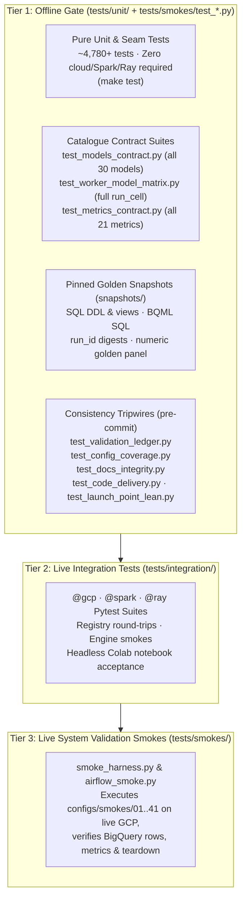

# Test Suite (`tests/`)

`scale-forecasting` uses a three-tier test architecture designed so that **every core invariant, model contract, SQL query, sizing formula, and documentation claim is verified offline in minutes** (`make test`), while live cloud integration and end-to-end multi-runtime smoke runs have dedicated, reproducible harnesses.



---

## Running the Tests

### 1. Fast Pre-Commit Consistency Tripwires (~2 seconds)

Runs automatically on `git commit` once enabled via `make hooks`:

```bash
make hooks  # one-time setup per clone
uv run pytest tests/unit/test_validation_ledger.py tests/unit/test_config_coverage.py tests/unit/test_docs_integrity.py -q
```

### 2. Full Offline Gate (`make test`)

Runs `ruff format --check`, `ruff check`, and all offline unit, contract, and snapshot tests (deselecting `@gcp`, `@spark`, and `@ray` markers):

```bash
make test
# Or directly with pytest:
uv run pytest -m "not gcp and not spark and not ray" -q
```

### 3. Live Cloud Integration & Smoke Suites

Requires an active GCP deployment and `SF_*` environment variables exported:

```bash
# Run live BigQuery/GCP integration tests
uv run pytest -m gcp tests/integration/

# Run headless Colab Enterprise acceptance across all 11 notebooks
uv run pytest -m gcp tests/integration/test_notebook_acceptance.py

# Run a numbered end-to-end smoke config from configs/smokes/
uv run python -m tests.smokes.smoke_harness --only 01_serverless_cpu
```

---

## Directory Structure

| Directory / File | Purpose |
| :--- | :--- |
| [`conftest.py`](./conftest.py) | Shared pytest fixtures, marker registrations (`gcp`, `spark`, `ray`, `airflow`), and autouse guards that prevent offline unit tests from reading ambient `SF_*` environment variables or making accidental cloud calls. |
| **[`unit/`](./unit/)** | 70+ test modules covering every module in `src/scale_forecasting/`. Includes contract suites (`test_models_contract.py`, `test_metrics_contract.py`, `test_worker_model_matrix.py`), architectural guards (`test_code_delivery.py`, `test_launch_point_lean.py`, `test_source_conventions.py`), and doc/config tripwires (`test_validation_ledger.py`, `test_config_coverage.py`, `test_docs_integrity.py`). |
| **[`unit/snapshots/`](./unit/snapshots/README.md)** | Golden snapshot files pinning generated BigQuery DDL (`ddl_deployment.sql`, `ddl_drop.sql`), analyst views (`views.sql`), BQML query shapes (`bigquery_native.sql`), deterministic `run_id` digests (`run_ids.json`), and numerical forecast outputs (`golden_panel.json`). |
| **[`integration/`](./integration/)** | Live integration tests against BigQuery, Dataproc Spark Connect/Serverless, Vertex AI Ray, `Registry` operations (`test_registry_ops_live.py`), and headless notebook execution (`test_notebook_acceptance.py`). |
| **[`smokes/`](./smokes/)** | Live end-to-end smoke driver (`smoke_harness.py`), Cloud Composer / Airflow DAG smoke driver (`airflow_smoke.py`), and offline tests for the harness and smoke configs (`test_harness.py`, `test_airflow_smoke.py`, `test_smoke_configs.py`). |

---

## Key Architectural Tripwires

Several unit test modules enforce structural guarantees across the repository:
- **[`test_validation_ledger.py`](./unit/test_validation_ledger.py):** Verifies that every shipped config (`configs/*.json` and `configs/smokes/*.json`) and every notebook (`notebooks/*.ipynb`) is recorded in [`docs/validation.md`](../docs/validation.md), that `CURRENT` rows match current architecture axes, and that `run_id` citations in [`docs/quota_and_scale.md`](../docs/quota_and_scale.md) resolve to valid ledger entries.
- **[`test_config_coverage.py`](./unit/test_config_coverage.py):** Joins every enumerable value reachable from `RunConfig` against shipped configs and `CURRENT` ledger rows, ensuring 100% of config options are either proven live or backed by a verified unit test span.
- **[`test_docs_integrity.py`](./unit/test_docs_integrity.py):** Audits every `.md` file in the repository for Markdown table column parity, Mermaid diagram syntax and label quoting, valid `RunConfig` JSON examples, valid relative links and `configs/*.json` paths, valid `python -m` CLI module references, absence of deprecated parameter names, and dynamic model/metric/view/smoke count alignment.
- **[`test_prebreak_snapshots.py`](./unit/test_prebreak_snapshots.py):** Locks the deterministic `<slug>-<12hex>` `run_id` digests of all shipped configurations and the numerical outputs of the golden panel so refactoring never alters run identity or model math silently.
- **[`test_code_delivery.py`](./unit/test_code_delivery.py):** Ensures `docker/Dockerfile` and `docker/cloudbuild.yaml` never bake `src/scale_forecasting` into the container image.
- **[`test_launch_point_lean.py`](./unit/test_launch_point_lean.py):** Ensures importing model classes and planning DAGs never eagerly imports heavy compute libraries (`torch`, `statsmodels`, `xgboost`, `lightgbm`, `prophet`, `neuralprophet`), keeping thin submission environments (such as Cloud Composer workers) lean.
- **[`test_api_docs_coverage.py`](./unit/test_api_docs_coverage.py):** Ensures every module re-exported by `scale_forecasting.__init__` and every subpackage is documented in `docs/api/`, every `docs/api/*.md` page is wired into `mkdocs.yml`, and every folder `README.md` in the repository spine includes a Mermaid diagram.
